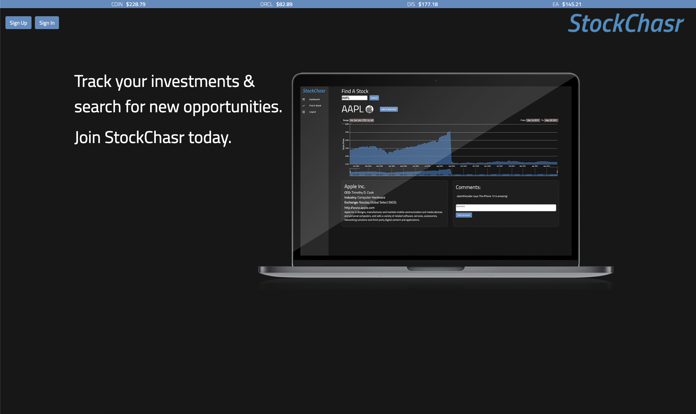
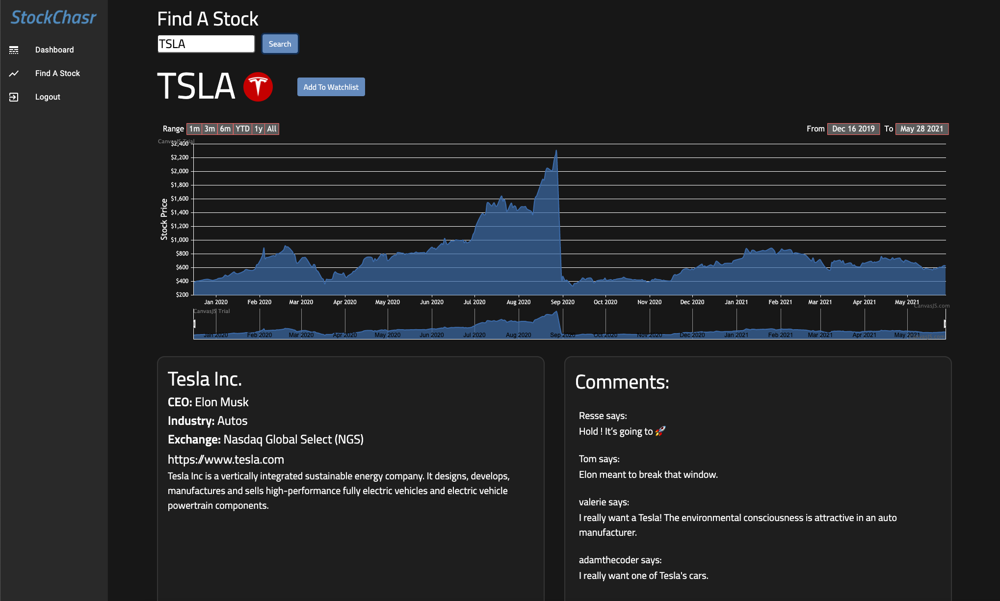
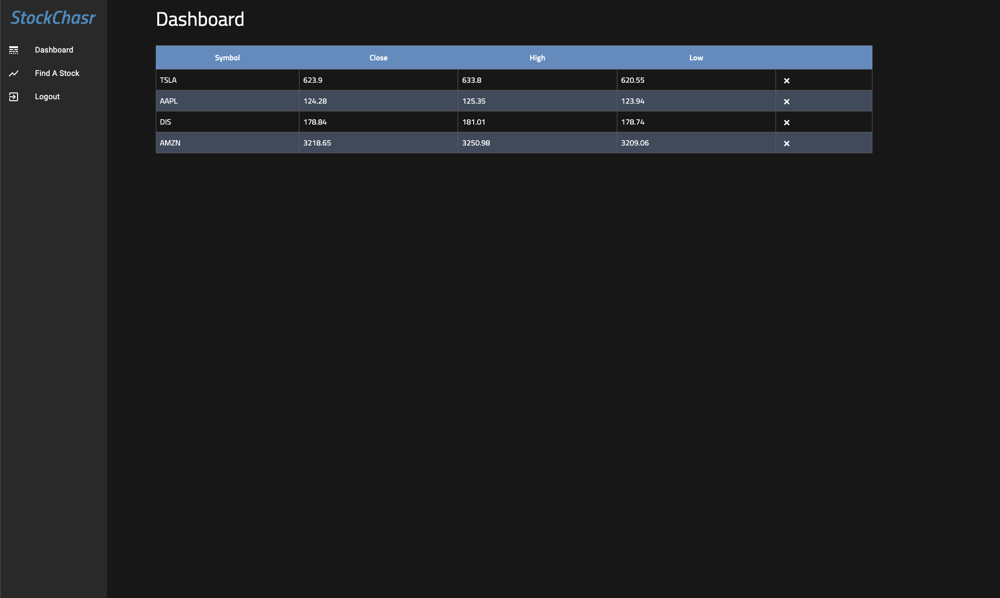

# StockChasr
  

  ## Link
  [Deployed Heroku Link](https://stockchasr.herokuapp.com/)

  ## Screenshots
  </img>
  </img>
  </img>

  ## Description 
An application that allows the user to search for and view current stock information. The user can search individual stocks by their ticker symbol; the search result includes a dynamic chart that displays current and past stock prices, which exchange the searched stock in traded on, and other relevent information about the stock's company. The user can add a stock to a watchlist that then displays the stock's most recent high low and close price. 
  ## Table of Contents 
  * [Installation](#installation) 
  * [Usage](#Usage)
  * [License](#License)
  * [Contributing](#Contributing)
  * [Testing](#Testing)
  * [Contact](#Contact)
  
  # Installation
  To install use the following code:
   npm i

  # Usage
  use git clone
  
  # License
    This project is created under the MIT license

  # Contributing
  Create a pull request

  # Testing
  

  # Contact
  If you have questions or concerns, please contact me at the following: 

  GitHub: adamalcantara , Arecio3, MooreFL 

  Email: alcantaradevelopment@gmail.com , cuba289@gmail.com, moorepr09@gmail.com
